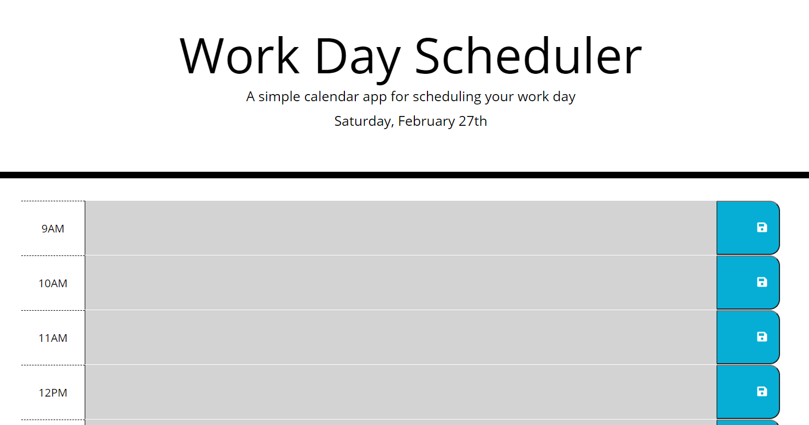

# professional-work-day-scheduler
A simple calendar application that allows a user to save events for each hour of the day by modifying starter code

# Description

The first element I noticed was missing was the date in the header. I used a variable and an id to generate the date with moment.js. After formatting the date to match the supplied animation I moved on to the hour blocks. 

Initially I thought the best way to organize the scheduler was a table in javascript with a for loop. I ultimately abandoned this idea after understanding that the scheduler would be static. Instead, I built the application within HTML. After building the time-blocks within HTML I looked up grid layouts in bootstrap. I found col-m-# which works with a 12 layout grid. I combined the layout with the classes supplied in the css file to create the schedule view.

One of the most challenging elements for me was coming up with a way to store and recall the user input for the time blocks. I've struggled with local storage in the past and it was difficult to grasp the concept of stringing the input to the correct time blocks. A for loop seemed like the best way to accomplish the task. I had to do quite a lot of console logs in order to identify the correct parent/child elements. 

Once the perRow text content was connected to the data-hour, I used an if else statement to designate the correct color. 

https://github.com/janee-elise-mays/professional-work-day-scheduler

